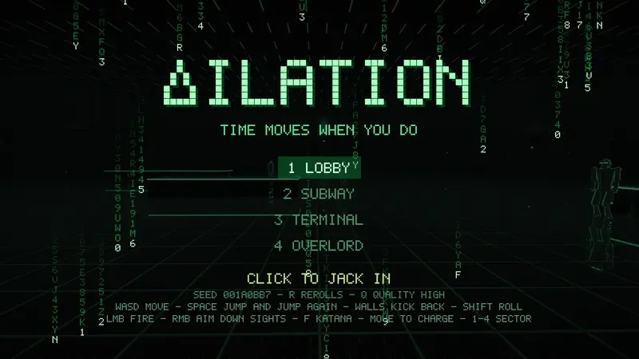
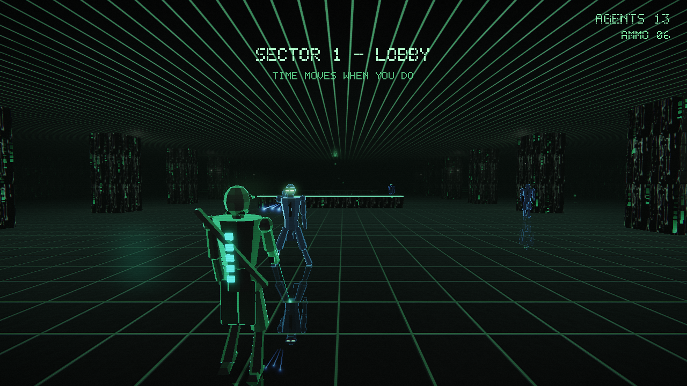
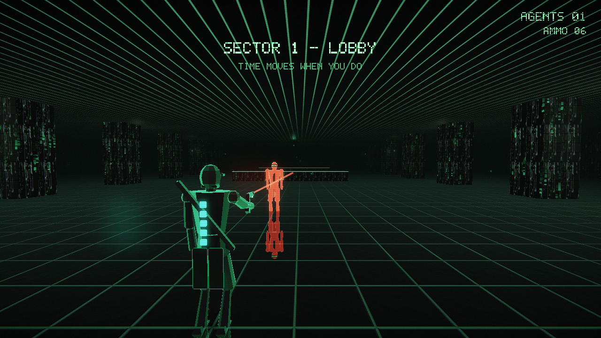
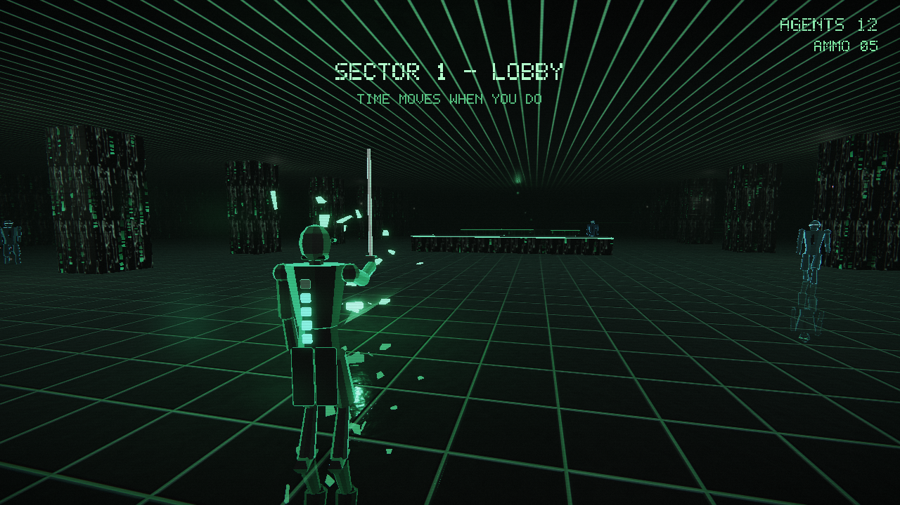
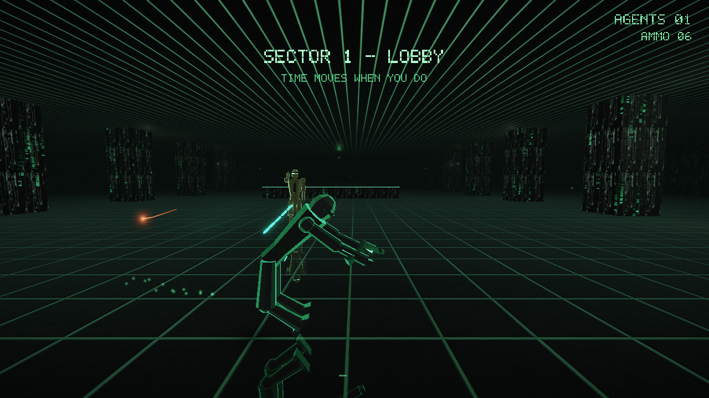
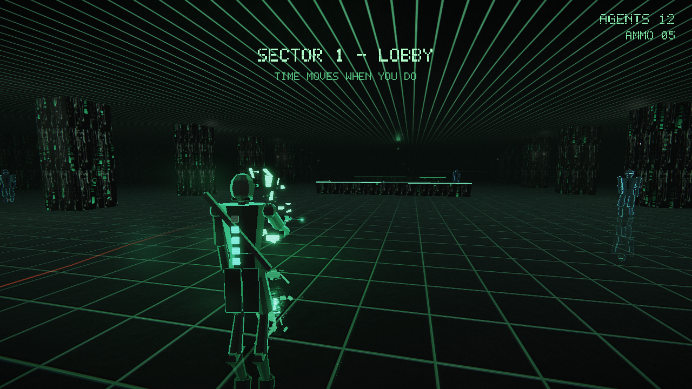

# Δ

**Time moves when you move.**

A single-file SUPERHOT × *Matrix* × **TRON** homage in the demoscene tradition: one C file,
no assets on disk, no engine. Every texture, level, mesh, sound, and font is
synthesized at startup or runtime. Stripped down to immediate-mode OpenGL 2 and
SDL2, the whole game is one `.c` file and compiles to ~155Kb.

Rendering is deferred through an HDR post stack: the scene draws into a
multisampled `RGBA16F` target and comes back out through a three-octave bloom
pyramid, an ACES tonemap, chromatic aberration, vignette, scanlines and grain.
Lighting is GGX with Schlick Fresnel and a hemisphere ambient. The whole chain
degrades in steps — no float target falls back to `RGBA8`, no framebuffer
objects at all falls back to tonemapping inline — so it still runs on a
GL 2.1 driver from 2006.



| Features | Image |
| --- | --- |
| **Locomotion** - Run, dodge, double-jump or wall-kick your way around enemies and incoming fire. |  |
| **Pistol** - The aim is physical: the gun is a thing your body carries, and the laser pointer is its barrel. Run and the beam swings with your stride; hold still for a second and it settles onto your look ray. Rounds go where the barrel points — fire mid-sprint with the gun swung low and the shot goes into the floor. The beam also charges as you move, dictating shot range; enemies highlight when within reach, and the pointer never shrinks below 1m so you always see where the gun is pointed. |  |
| **Katana** - Deflect incoming bullets with your katana or take out enemies at close range. |  |
| **Dodge roll** - `SHIFT` / `CTRL` / `C` rolls you sideways evading enemy fire |  |
| **Shatter** - Defeating enemies sometimes leaves behind health packs or ammo. |  |


## Build & run

Requires SDL2 and OpenGL.

```sh
./build.sh        # clang on macOS, gcc on Linux
./dilation         # play
./dilation --level 2   # jump straight to a sector (0-based)
./dilation --seed 1234 # reseed the procedural levels
```

Or build by hand:

```sh
gcc -Os dilation.c -o dilation -lSDL2 -lGL -lm        # Linux
clang -Os dilation.c -o dilation -I/opt/homebrew/include -L/opt/homebrew/lib \
  -lSDL2 -framework OpenGL -lm                       # macOS (Homebrew SDL2)
```

## Controls

| Input | Action |
| --- | --- |
| `WASD` | Move (also charges the pistol's range) |
| Mouse | Look |
| `SPACE` | Jump — press again in the air for a double jump; into a wall to kick off |
| `SHIFT` / `CTRL` / `C` | Dodge roll |
| Left mouse | Fire — shots follow the barrel; stand still ~1s to settle the aim (range grows the more you move) |
| Right mouse | Katana — kills up close, deflects bullets |
| `1`–`4` / `←` `→` | Select sector (title screen) |
| `M` | Mute / unmute |
| `ESC` | Sector select / quit |

Clear every agent in a sector to win, then click to jack straight into the next one.

## Regression mode

`./dilation --smoke` runs a fixed, deterministic choreography and writes nine PPM
screenshots, then prints `SMOKE OK`. It forces `tscale=1` and fixed RNG seeds,
so output is byte-stable run-to-run — a cheap visual/behavioral regression gate
for refactors.

Purely visual randomness (camera shake, the HUD damage glitch) draws from a
second RNG stream, so what is on screen can never perturb the simulation the
gate is measuring.

## License

CC0 / public domain.
