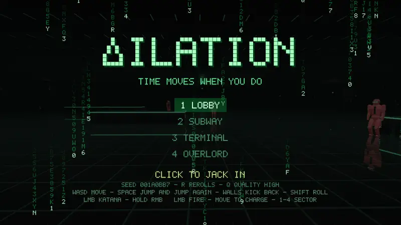
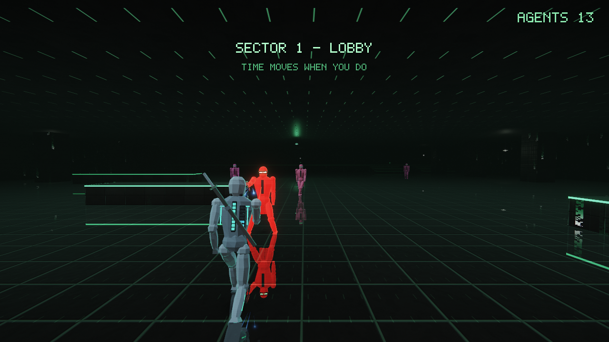
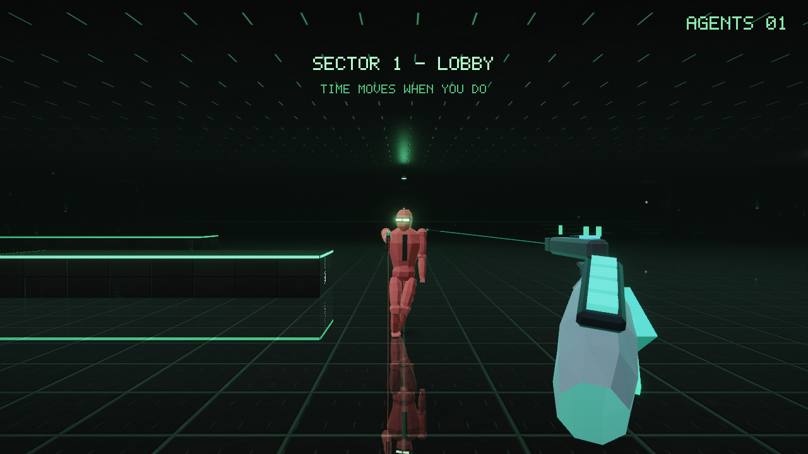
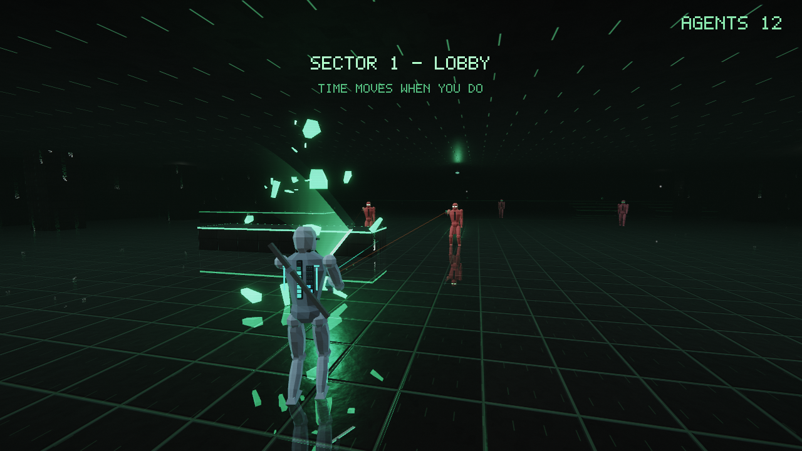
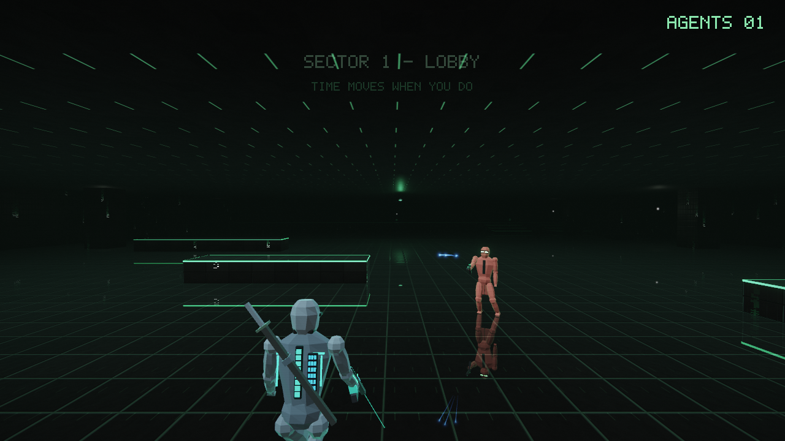
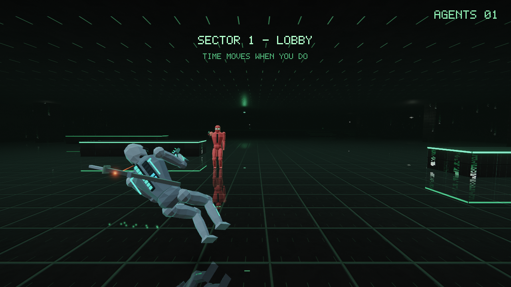
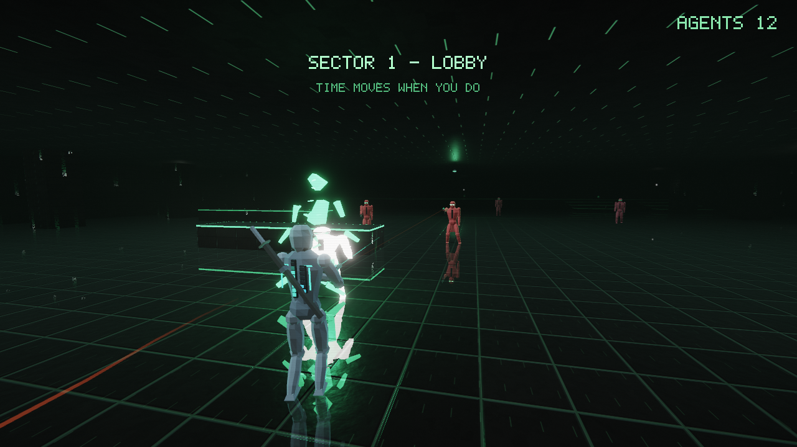
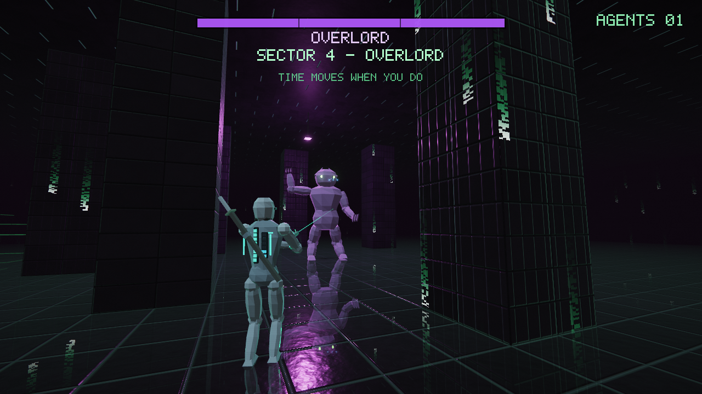

# Δ

**Time moves when you move.**

A single-file SUPERHOT × *Matrix* × **TRON** homage in the demoscene tradition: one C file,
no assets on disk, no engine. Every texture, level, mesh, sound, and font is
synthesized at startup or runtime. Stripped down to immediate-mode OpenGL 2 and
SDL2, the whole game is one `.c` file and compiles to ~228 KiB on macOS.

The forward renderer draws into a 4x multisampled `RGBA16F` target, then
composites a five-octave bloom pyramid, ACES tonemap and restrained lens effects.
GGX lighting, procedural normal maps, baked occlusion and planar floor reflections
keep the black architecture readable. Broad cool key/fill lighting reveals the
characters' polygon planes; narrow emerald rims and suit seams provide the TRON
accent. The player wears graphite ceramic, agents wear red crystal suits with
emerald shades, and the OVERLORD keeps its violet alien silhouette.

Torso, pelvis, skull and limbs come from small sculpted, triangulated profiles,
cached as display lists. The avatar still uses one rig for animation and physical
aiming. Hermite foot swings meet the floor with continuous velocity, moving feet
hold world-space stance contacts, and two-bone IK handles the knees and terrain.
Turning, stopping, strafing, landing and aiming use frame-rate-independent easing.
The pistol stays in the right hand and the katana in the left; ADS rounds and the
laser originate at the actual scaled barrel. Left click cuts while zoomed out;
hold right mouse to zoom in, then left click fires. The gun laser is the only
reticle, stops on the first body or surface, and switches off when ammo is empty.

Health drains down a segmented light on the avatar's spine, turning amber and
then red as it falls. A cyan rack beside it has one light per round. The wrist
repeats health and the pistol carries its own ammo panel for ADS. Health and ammo
have no screen-space HUD readouts.

Three quality tiers scale scene resolution, MSAA, bloom and light count. LOW has
a directional edge filter when MSAA is unavailable; MEDIUM and HIGH retain 2x/4x
MSAA. Only the selected bloom octaves allocate targets. `Q` pins a tier, or the
game adapts to its measured frame interval. Drivers without float targets use
`RGBA8`; drivers without FBOs use inline tonemapping. `--no-post` exercises that
fallback explicitly.

The synthesizer keeps music on a real-time clock and bends world SFX with time.
Sample-smoothed pitch/mute controls and short stereo room tails soften transitions
and place shots in the architecture. Audio controls use SDL atomics; voice edits
hold the audio-device lock briefly, following the
[SDL threading contract](https://wiki.libsdl.org/SDL2/SDL_LockAudioDevice).

Every sector is generated from the seed on the title screen and checked for
reachability before you jack in; `R` rerolls it into a different building.



| Features | Image |
| --- | --- |
| **Locomotion** - Planted stance contacts, smooth foot swings and terrain-aware IK; run, dodge, double-jump or wall-kick through incoming fire. |  |
| **Pistol** - Hold right mouse to aim, then left click to fire. The laser and rounds follow the drawn barrel, including sway and recoil. Its world-space dot is the reticle; the bright section shows charged shot reach and reachable enemies highlight red. Walls, raised floors and the nearest body stop it. Empty ammo extinguishes the pointer. |  |
| **Katana** - Left click while zoomed out draws the blade with the left hand: a wind-up over the shoulder and a cut across to the right hip. Deflect incoming bullets or take out close agents; cover blocks both. Switching aim mode cancels queued attacks. |  |
| **Vitals** - A segmented spine light shows health; a cyan rack counts ammo. Matching wrist and pistol indicators remain visible in ADS. The player has a clean silhouette without rear flaps. |  |
| **Dodge roll** - `SHIFT` / `CTRL` / `C` rolls you sideways evading enemy fire |  |
| **Shatter** - Defeating enemies sometimes leaves behind health packs or ammo. |  |


## Build & run

Requires SDL2 (2.0.2 or newer) and compatibility-profile OpenGL 2.1.
`build.sh` discovers SDL through `pkg-config`, `sdl2-config` or Homebrew and
honors `CC`. The macOS and Linux recipes share the same C source.

```sh
./build.sh        # clang on macOS, gcc on Linux
./dilation         # play
./dilation --level 2   # jump straight to a sector (0-based)
./dilation --seed 1234 # reseed the procedural levels
./dilation --quality low   # pin a tier: low, medium, high (default: auto)
./dilation --msaa 0    # scene-target multisampling off (default 4x, capped by the tier)
./dilation --seed-sweep 200   # validate 800 layouts plus motion/navigation/combat contracts
./dilation --smoke      # invariants and 23 combat/motion/vitals captures
./dilation --benchmark  # same gate, including GPU completion in frame timings
./dilation --smoke --no-post  # check the inline-tonemap fallback
```

Or build by hand:

```sh
gcc -Os dilation.c -o dilation -lSDL2 -lGL -lm        # Linux
clang -Os dilation.c -o dilation -I/opt/homebrew/include -L/opt/homebrew/lib \
  -lSDL2 -framework OpenGL -lm                       # macOS (Homebrew SDL2)
```

## Controls

| Input | Action |
| --- | --- |
| `WASD` | Move (also charges the pistol's range) |
| Mouse | Look |
| `SPACE` | Jump — press again in the air for a double jump; push into a wall and press to kick off it |
| `SHIFT` / `CTRL` / `C` | Dodge roll |
| Left mouse, zoomed out | Katana — close-range cuts and bullet deflection |
| Right mouse (hold) | Zoom in to aim the pistol |
| Left mouse while holding right mouse | Fire the pistol along its barrel; movement charges shot range |
| `1`–`4` / `←` `→` | Select sector (title screen) |
| `R` | Reroll the sector's layout (title screen) |
| `Q` | Cycle the quality tier (low / medium / high) |
| `F11` / `Alt`+`Enter` | Toggle fullscreen |
| `M` | Mute / unmute |
| `ESC` | Sector select / quit |

Clear every agent in a sector to win, then click to jack straight into the next one.

## Validation and audit

`./dilation --smoke` is the invariant gate. It validates every sector at the play
seed plus 48 more seeds, checking requested agent counts and reachability of
every agent and item. Its
350-frame choreography captures 23 views: combat, shatter, katana, roll, boss,
ADS, actual frozen time, strafe, jump, double jump and physical gauges with
full, wounded and empty-ammo states. It checks finite simulation
and rig state, bone lengths, muzzle alignment, fixed pool capacity and the
primitive cache. Failure returns a nonzero exit status.

Motion contracts also run at 30/60/144/240 Hz and three timescales. Navigation
fixtures check roof drops, blocked climbs, legal step-ups and steering. This audit
fixed velocity samples being discarded at MINTS, roof exits excluded by a
symmetric step-height rule, an ADS muzzle extending beyond the rendered barrel,
and a fallback viewport that was not refreshed after resizing. Combat fixtures
check floor/roof/ceiling intersections, vertical body hits, nearest-target
ordering and grazing projectile sweeps at 12 frame-rate/timescale combinations.
They also verify barrel obstruction, cover for cuts/parries, muzzle and bullet
alignment, the mouse-mode input buffers, and empty-ammo pointer suppression.

`--benchmark` adds GPU completion to the timing sample and checks a 16.67 ms
median budget. Plain smoke measures CPU submission with an 8 ms median budget.
Both exclude capture I/O. Software rasterizers report timings without enforcing
the hardware budget. The strict screenshot comparator remains optional; old
`baseline/` images deliberately do not gate this visual overhaul.

Measured after the controls/vitals update on an Apple M4 Max, OpenGL 2.1 Metal,
1280x720 (one run per tier):

| Quality | CPU + GPU median | p95 |
| --- | ---: | ---: |
| HIGH | 1.84 ms | 3.29 ms |
| MEDIUM | 1.32 ms | 2.09 ms |
| LOW | 1.01 ms | 1.75 ms |

During the initial renderer overhaul, a separate comparison over the original
206-frame choreography measured
1.86 ms median / 3.17 ms p95 before and 1.58 ms / 3.10 ms after. These are local
measurements, not a guarantee for other GPUs or resolutions. The M4 Max can also
show timing variation across tiers. macOS was built and run; Linux and older GL
hardware have not been exercised in this audit.

The 256-seed sweep passed all 1,024 layouts. All quality tiers and `--no-post`
passed the smoke gate. An offline synthesis check covered all 15 sound types,
three timescales, track transitions and muting, with finite output below the
limiter ceiling; it also passed UndefinedBehaviorSanitizer. Runtime geometry,
textures, sound and fonts still require no external assets. Purely visual
randomness stays on its separate RNG stream.



## License

CC0 / public domain.
